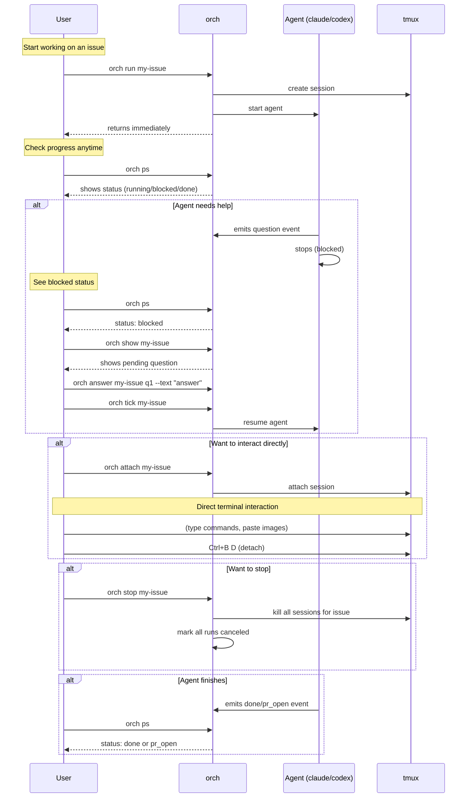
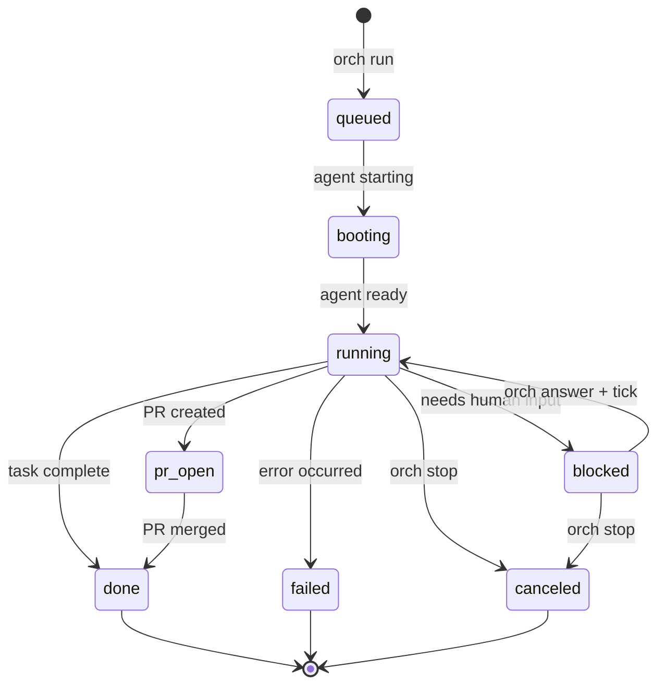
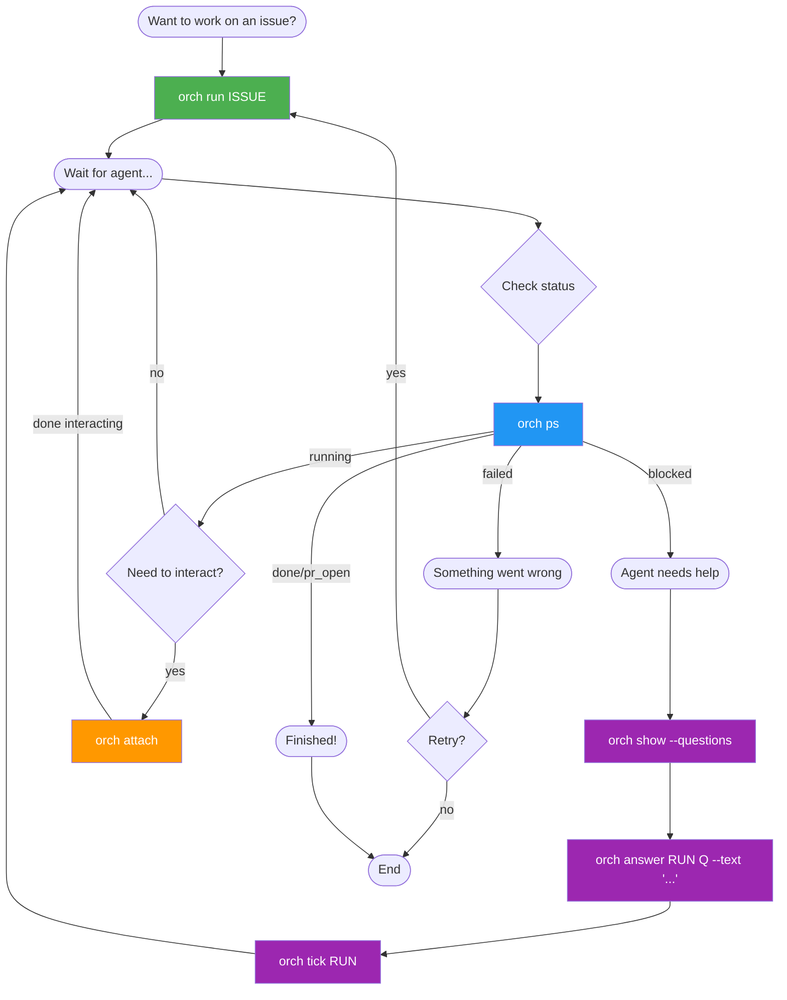

# orch

Orchestrator for managing multiple LLM CLIs (claude/codex/gemini) using a unified vocabulary of **issue/run/event**.

## Overview

orch operates **non-interactively** by default. When human input is needed, it uses events (`question`) to externalize the interaction, and `answer` + `tick` to resume.

## User Interaction Flow



## State Machine



## When to Use Each Command



## Quick Reference

| Situation | Command |
|-----------|---------|
| Start working on an issue | `orch run ISSUE` |
| Continue from an existing run | `orch continue ISSUE#RUN_ID` |
| Continue from a branch | `orch continue ISSUE --branch BRANCH` |
| Check what's running | `orch ps` |
| Watch agent work / interact | `orch attach RUN` |
| See run details | `orch show RUN` |
| Agent is blocked - see why | `orch show RUN --questions` |
| Answer agent's question | `orch answer RUN QID --text "..."` |
| Resume after answering | `orch tick RUN` |
| Stop all runs for an issue | `orch stop ISSUE` |
| Stop a specific run | `orch stop ISSUE#RUN_ID` |
| Stop all runs globally | `orch stop --all` |
| Fix problems | `orch repair` |

## Statuses

| Status | Meaning | User Action |
|--------|---------|-------------|
| `queued` | Run created, waiting to start | Wait |
| `booting` | Agent is starting up | Wait |
| `running` | Agent is actively working | Wait, or `attach` to watch |
| `blocked` | Agent needs input | `show` → `answer` → `tick` |
| `pr_open` | PR created, awaiting review | Review the PR |
| `done` | Work completed | Nothing - celebrate! |
| `failed` | Run failed | Check logs, maybe retry |
| `canceled` | Manually stopped | Nothing |

## Background Monitoring

orch automatically runs a background daemon that monitors all running agents. You don't need to manage it manually.

**What the daemon does:**
- Monitors tmux sessions for all running runs
- Detects when agents finish (done/failed)
- Detects when agents are stuck or need input (blocked)
- Updates run status automatically

**If something goes wrong:**
```bash
orch repair    # Fixes daemon, stale states, orphaned sessions
```

## Configuration

```bash
# Set vault path (required)
export ORCH_VAULT=~/vault

# Or pass per-command
orch --vault ~/vault ps
```

## Vault Structure

```
vault/
├── issues/
│   └── <ISSUE_ID>.md      # Issue specification
└── runs/
    └── <ISSUE_ID>/
        └── <RUN_ID>.md    # Run log with events
```

## Vocabulary

| Term | Description |
|------|-------------|
| **Issue** | A unit of work/specification (e.g., `plc124`) |
| **Run** | A single execution attempt for an issue |
| **Event** | A single append-only record in a run |
| **RUN_REF** | Reference format: `ISSUE_ID#RUN_ID` or just `ISSUE_ID` (latest) |
