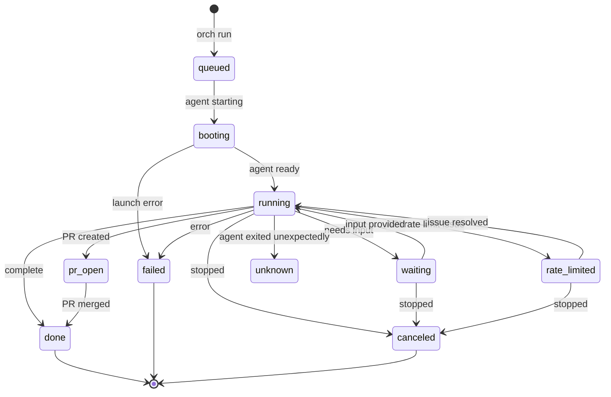

# Core Concepts

This document defines the key terminology used throughout orch. Understanding these concepts is essential for effective usage.

## Overview

orch orchestrates LLM agents (like Claude, Codex, Gemini) to work on tasks defined in **Issues**. Each attempt to complete an issue is called a **Run**, and the progress of a run is tracked through **Events**.

```
Issue → Run(s) → Events
        ↳ Worktree
        ↳ Branch
        ↳ Tmux Session
```

## Glossary

### Issue

A **unit of work** or specification for an agent to complete.

- **NOT** a GitHub issue (unless using the GitHub backend)
- Think of it as a "task ticket" or "work item"
- Stored as a markdown file with YAML frontmatter
- Can contain requirements, acceptance criteria, context

**Example issue file:**
```yaml
---
type: issue
id: fix-login-bug
title: Fix login timeout issue
status: open
---

# Fix login timeout issue

Users report being logged out after 5 minutes of inactivity.
The session should last 30 minutes.

## Acceptance Criteria
- [ ] Session lasts 30 minutes
- [ ] Add tests for session timeout
```

### Run

A **single execution attempt** for an issue.

- One issue can have many runs (retries, different approaches)
- Each run gets its own isolated environment (worktree, branch)
- Identified by a timestamp-based ID: `YYYYMMDD-HHMMSS`
- Referenced as `ISSUE_ID#RUN_ID` (e.g., `fix-login#20260120-163045`)

**Key properties:**
- `issue_id` - The parent issue
- `run_id` - Timestamp identifier
- `status` - Current state (running, waiting, done, etc.)
- `agent` - Which LLM CLI is being used
- `worktree` - Isolated git working directory
- `branch` - Git branch for this run

### Issue Hex ID

Every file-backend issue also has a deterministic hex identifier defined by
[ADR-0001](./adr/ADR-0001-issue-hex-ids.md): the lowercase SHA-256 hash of its
human-readable issue ID.

- The CLI displays the first 8 characters (for example, `afa27b44`).
- Any unique lowercase prefix from 7 through 64 characters can be used
  anywhere an issue ID is accepted.
- Prefixes of 2 through 6 characters remain reserved for run short IDs, so
  issue and run references are unambiguous.
- An ambiguous issue prefix fails with the matching issue names; extend the
  prefix to disambiguate it.

### Event

An **append-only record** in a run's log.

- Events are never modified after creation
- Track status changes, artifacts, test results, notes
- Form the complete history of a run

**Event format:**
```
- 2026-01-20T16:30:45+09:00 | status | running | agent=claude
- 2026-01-20T16:31:20+09:00 | artifact | branch | name=issue/fix-login/run-20260120-163045
- 2026-01-20T16:45:00+09:00 | artifact | pr | url=https://github.com/...
- 2026-01-20T16:45:05+09:00 | status | pr_open |
```

### Status

The **current state** of a run, derived from its events.



| Status | Description | User Action |
|--------|-------------|-------------|
| `queued` | Run created, waiting to start | Wait |
| `booting` | Agent is launching | Wait |
| `running` | Agent actively working | Wait, or attach to watch |
| `waiting` | Agent needs human input | Attach and provide input |
| `rate_limited` | API/rate limit issue | Wait or check credentials |
| `pr_open` | Pull request created | Review the PR |
| `done` | Work completed successfully | Celebrate! |
| `failed` | Run encountered an error | Check logs, maybe retry |
| `canceled` | Manually stopped | - |
| `unknown` | Agent exited unexpectedly | Investigate |

### Phase

An **optional workflow stage** within a run.

Phases help track progress through multi-step tasks:

| Phase | Description |
|-------|-------------|
| `plan` | Agent is analyzing and planning |
| `implement` | Writing code |
| `test` | Running tests |
| `pr` | Creating pull request |
| `review` | Addressing review feedback |

### Worktree

A **git worktree** created for each run.

- Provides complete isolation from other runs
- Each run works on its own copy of the codebase
- Located in `~/.orch/worktrees/<issue>/<shortid>_<agent>_<runid>/` by default
- Automatically created by `orch run`
- Can be reused with `orch restart-from`

**Why worktrees?**
- Multiple agents can work on different issues simultaneously
- No conflicts between concurrent runs
- Easy to inspect or discard changes
- Clean separation of concerns

### Issues Root

The **directory containing issue markdown files**.

- Can be a separate directory or within your project
- Set via `issues.path` in `.orch/config.yaml`
- Also stores run logs in `runs/` subdirectory

**Structure:**
```
issues-root/
├── issues/
│   ├── fix-login.md
│   └── add-feature.md
└── runs/
    ├── fix-login/
    │   ├── 20260120-163045.md
    │   └── 20260120-171230.md
    └── add-feature/
        └── 20260120-180000.md
```

### Project Root

The **git repository** where `.orch/` configuration lives.

Contains:
- `.orch/config.yaml` - Project configuration

This is separate from Issues Root - your code lives in Project Root, while tasks/issues can be stored elsewhere.

The daemon itself is global (one per machine, not per project). Its files live
in XDG locations, not in the project root:

- Logs: `~/Library/Logs/orch/daemon.log` (macOS) / `~/.local/state/orch/daemon.log` (Linux)
- Socket, PID, lock: `~/Library/Caches/orch/run/` (macOS) / `$XDG_RUNTIME_DIR/orch/` (Linux)
- Project registry: `~/.config/orch/projects/<project_id>.yaml` (written by `orch daemon repo register`)

### Daemon and Worker

Two long-lived processes cooperate to execute runs:

- The **daemon** (master) owns all issue/run/event state and resolves project
  identities. It starts automatically on your first orch command.
- The **worker** launches and supervises the actual agent sessions on its
  host. It auto-starts on demand when a run targets the master's own host
  (ADR-0002); other hosts need an explicit `orch worker start`.
  `ORCH_WORKER_AUTOSTART=0` restores fully manual worker management.

On a single machine you run both locally and never notice the split. The same
model scales to multiple hosts: workers on other machines register to one
daemon (see [Remote Usage](./remote-usage.md)).

### RUN_REF

A **reference format** for identifying runs:

| Format | Example | Meaning |
|--------|---------|---------|
| `ISSUE_ID#RUN_ID` | `fix-login#20260120-163045` | Specific run |
| `ISSUE_ID` | `fix-login` | Latest run for issue |
| `SHORT_ID` | `31909e` | 6-character hex lookup |

### SHORT_ID

A **6-character hex identifier** for quick reference.

- Generated from `SHA256(ISSUE_ID + "#" + RUN_ID)[:6]`
- Useful for quick commands: `orch attach 31909e`
- Shown in `orch ps` output

## The Big Picture

```
┌─────────────────────────────────────────────────────────────┐
│                        Issues Root                          │
│  ┌────────────────┐  ┌────────────────┐                    │
│  │ issues/        │  │ runs/          │                    │
│  │  ├─ task-1.md  │  │  ├─ task-1/    │                    │
│  │  └─ task-2.md  │  │  │   └─ *.md   │  (run logs)       │
│  └────────────────┘  │  └─ task-2/    │                    │
│                      └────────────────┘                    │
└─────────────────────────────────────────────────────────────┘

┌─────────────────────────────────────────────────────────────┐
│                      Project Root                           │
│  ┌────────────────┐                                        │
│  │ .orch/         │                                        │
│  │  └─ config.yaml│  (configuration)                       │
│  └────────────────┘                                        │
│  ┌────────────────┐                                        │
│  │ src/           │  (your code)                           │
│  └────────────────┘                                        │
└─────────────────────────────────────────────────────────────┘

┌─────────────────────────────────────────────────────────────┐
│                Global daemon + worker (per machine)         │
│  daemon: state, identity   logs/socket in XDG dirs          │
│  worker: launches agent sessions (`orch worker start`)      │
└─────────────────────────────────────────────────────────────┘

┌─────────────────────────────────────────────────────────────┐
│                       Worktrees                             │
│  ~/.orch/worktrees/                                        │
│    ├─ task-1/                                              │
│    │   └─ abc123_claude_20260120-163045/  (isolated copy)  │
│    └─ task-2/                                              │
│        └─ def456_opencode_20260120-170000/                 │
└─────────────────────────────────────────────────────────────┘
```

## Non-Interactive by Default

A key design principle of orch:

- Agents run in the background without blocking your terminal
- Use `orch ps` to check status anytime
- Use `orch attach` when you need to interact
- Human input is handled through the `waiting` status

This allows you to:
- Start multiple agents working on different issues
- Context-switch between tasks freely
- Get notified (via Slack, etc.) when input is needed
- Review completed work at your convenience
