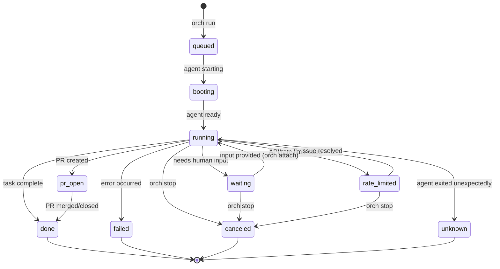

# Status Reference

Run status is derived from events and represents the current state of a run. Understanding statuses is key to effectively managing agent workflows.

## Status State Machine



## Status Definitions

### Active Statuses

These indicate the run is in progress or needs attention.

#### `queued`

Run has been created but the agent hasn't started yet.

| Aspect | Details |
|--------|---------|
| What's happening | Run record created, waiting to start |
| User action | Wait (usually transitions quickly) |
| Next status | `booting` |

#### `booting`

Agent is starting up.

| Aspect | Details |
|--------|---------|
| What's happening | tmux session created, agent launching |
| User action | Wait |
| Next status | `running` |
| Typical duration | 5-30 seconds |

#### `running`

Agent is actively working on the task.

| Aspect | Details |
|--------|---------|
| What's happening | Agent analyzing, coding, testing |
| User action | Wait, or attach to watch |
| Next status | `waiting`, `pr_open`, `done`, `failed` |

#### `waiting`

Agent needs human input to continue.

| Aspect | Details |
|--------|---------|
| What's happening | Agent asking a question or waiting for decision |
| User action | `orch attach` to provide input |
| Next status | `running` (after input) |

Common reasons for waiting:
- Agent asking clarifying question
- Permission confirmation needed
- Design decision required
- Error needs human judgment

#### `rate_limited`

API or rate limit issue preventing progress.

| Aspect | Details |
|--------|---------|
| What's happening | API key issue, rate limit, service unavailable |
| User action | Check credentials, wait for rate limit reset |
| Next status | `running` (when resolved) |

#### `pr_open`

Agent has created a pull request.

| Aspect | Details |
|--------|---------|
| What's happening | PR created, awaiting review/merge |
| User action | Review the PR |
| Next status | `done` (typically) |

### Terminal Statuses

These indicate the run has finished.

#### `done`

Task completed successfully.

| Aspect | Details |
|--------|---------|
| What's happening | Agent finished the task |
| User action | Review work, merge PR if applicable |

#### `failed`

Run encountered an error.

| Aspect | Details |
|--------|---------|
| What's happening | Unrecoverable error occurred |
| User action | Check logs, fix issue, retry if needed |

Common failure reasons:
- Git conflicts
- Build failures
- Test failures (if agent stops on failure)
- Agent crash

#### `canceled`

Run was manually stopped.

| Aspect | Details |
|--------|---------|
| What's happening | User ran `orch stop` |
| User action | None required |

#### `unknown`

Agent exited unexpectedly.

| Aspect | Details |
|--------|---------|
| What's happening | Agent process ended without proper completion |
| User action | Investigate, possibly restart |

The daemon detects this by:
1. No Claude/agent UI elements visible
2. Shell prompt visible (agent exited to shell)

## Status Queries

### Filter runs by status

```bash
# Active runs
orch ps --status running,waiting

# All waiting runs
orch ps --status waiting,rate_limited

# Completed runs
orch ps --status done

# Problem runs
orch ps --status failed,unknown
```

### SQL queries

```sql
-- Count by status
SELECT status, COUNT(*) 
FROM runs 
GROUP BY status;

-- Running runs with duration
SELECT 
  issue_id,
  run_id,
  status,
  datetime('now') - created as duration_seconds
FROM runs
WHERE status = 'running';

-- Recently waiting
SELECT * FROM runs
WHERE status = 'waiting'
ORDER BY updated_at DESC
LIMIT 10;
```

## Status Transitions

### Normal flow

```
queued → booting → running → pr_open → done
```

### With human interaction

```
queued → booting → running → waiting → running → pr_open → done
```

### Failure scenarios

```
queued → booting → running → failed
queued → booting → failed  (agent failed to start)
running → unknown (agent crashed)
```

### Manual intervention

```
running → canceled (user stopped)
waiting → canceled (user stopped)
```

## Monitoring Status

### CLI

```bash
# Quick status check
orch ps

# Watch for changes
watch -n 5 orch ps

# JSON for scripting
orch ps --json | jq '.runs[] | select(.status == "waiting")'
```

### Notifications

Configure Slack notifications for status changes:

```yaml
slack:
  enabled: true
  webhook_url: ${SLACK_WEBHOOK}
  notify_on:
    - waiting
    - rate_limited
    - failed
```

## Best Practices

### Handling waiting runs

1. Check `orch ps` regularly
2. Set up Slack notifications for `waiting`
3. Use `orch attach` to provide input
4. Document common questions in issue templates

### Handling failed runs

1. Check daemon logs: `tail ~/Library/Logs/orch/daemon.log  # Linux: ~/.local/state/orch/daemon.log`
2. Attach to see error: `orch attach run-ref`
3. Check if issue is retriable
4. Use `orch restart-from` to retry from last state

### Monitoring active runs

```bash
# Simple loop
while true; do
  clear
  orch ps --status running,waiting,booting
  sleep 10
done
```

Or use `orch monitor` for an interactive TUI.
