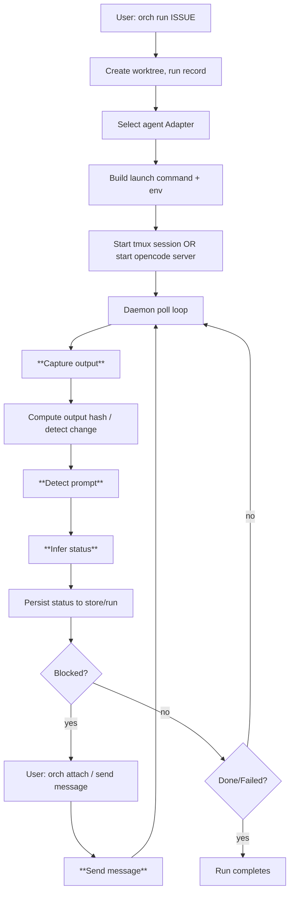

# Agent Architecture (internal/agent)

This document describes how `orch` launches and monitors LLM “agents” (external CLIs / servers), with a focus on the implementation in `internal/agent/`.

## High-level model

`orch` treats each agent as either:

1. **tmux-based interactive CLI** (Claude/Codex/Gemini/Custom)
2. **HTTP-based server** (OpenCode)

The core design principle is that `orch` does **not** query an agent for structured state. Instead, it:

- launches the agent process
- **captures output** (tmux pane capture or OpenCode HTTP messages)
- **infers status** from output heuristics (tmux) or session status API (OpenCode)
- **sends user messages** back to the agent (tmux send-keys or OpenCode HTTP prompt)

## Components in `internal/agent/`

### Agent type selection

- `internal/agent/adapter.go`: defines `AgentType`, `InjectionMethod`, `LaunchConfig`, and the `Adapter` interface.

Key types:

```go
// internal/agent/adapter.go

type AgentType string

const (
    AgentClaude   AgentType = "claude"
    AgentCodex    AgentType = "codex"
    AgentGemini   AgentType = "gemini"
    AgentOpenCode AgentType = "opencode"
    AgentCustom   AgentType = "custom"
)

type InjectionMethod string

const (
    InjectionArg  InjectionMethod = "arg"
    InjectionTmux InjectionMethod = "tmux"
    InjectionHTTP InjectionMethod = "http"
)

type Adapter interface {
    Type() AgentType
    LaunchCommand(cfg *LaunchConfig) (string, error)
    IsAvailable() bool
    PromptInjection() InjectionMethod
    ReadyPattern() string
}
```

Adapter implementations:

- `internal/agent/claude.go` → `ClaudeAdapter`
- `internal/agent/codex.go` → `CodexAdapter`
- `internal/agent/gemini.go` → `GeminiAdapter`
- `internal/agent/opencode.go` → `OpenCodeAdapter`
- `internal/agent/custom.go` → `CustomAdapter`

`GetAdapter()` in `internal/agent/adapter.go` selects an adapter.

### Launch config and environment

`LaunchConfig.Env()` provides `orch` metadata to the agent process:

- `ORCH_ISSUE_ID`
- `ORCH_RUN_ID`
- `ORCH_RUN_PATH`
- `ORCH_WORKTREE_PATH`
- `ORCH_BRANCH`
- `ORCH_VAULT`

See `internal/agent/adapter.go`.

For OpenCode specifically, `OpenCodeAdapter.Env()` injects `OPENCODE_PERMISSION=...` to allow autonomous operation without interactive permissions.

## Supported agents and differences

### Claude (`claude`)

- Adapter: `internal/agent/claude.go`
- Launch: `claude --dangerously-skip-permissions [--profile ...] [--resume ...] "<prompt>"`
- Prompt injection: `InjectionArg`
- Output capture: tmux pane capture
- Status detection: tmux heuristics
- Message send: tmux send-keys

### Codex (`codex`)

- Adapter: `internal/agent/codex.go`
- Launch: `codex --yolo '<prompt>'`
- Prompt injection: `InjectionArg`
- Output capture: tmux pane capture
- Status detection: tmux heuristics
- Message send: tmux send-keys

### Gemini (`gemini`)

- Adapter: `internal/agent/gemini.go`
- Launch: `gemini --yolo --prompt-interactive "<prompt>"`
- Prompt injection: `InjectionArg`
- Output capture: tmux pane capture
- Status detection: tmux heuristics
- Message send: tmux send-keys

### OpenCode (`opencode`)

OpenCode is fundamentally different: it can run as an HTTP server and exposes sessions/messages over an API.

- Adapter: `internal/agent/opencode.go`
- Launch:
  - New server: `opencode serve --port <port> --hostname 0.0.0.0`
  - Continue local session: `opencode --continue` (or `--prompt ...`)
- Prompt injection: `InjectionHTTP`
- Output capture: HTTP messages fetched via `internal/agent/opencode_client.go`
- Status detection: session status fetched via HTTP API
- Message send: HTTP prompt to `/session/{id}/message`

### Custom (`custom`)

- Adapter: `internal/agent/custom.go`
- Launch: the user-supplied `--agent-cmd` command string
- Prompt injection: `InjectionArg` (the adapter itself does not inject; orchestration decides how to pass prompt)
- Output capture: tmux pane capture
- Status detection: tmux heuristics
- Message send: tmux send-keys

## Runtime managers (status, output capture, send)

The runtime interface used by daemon/monitoring is `AgentManager` in `internal/agent/manager.go`:

```go
// internal/agent/manager.go

type AgentManager interface {
    IsAlive(run *model.Run) bool
    GetStatus(run *model.Run, output string, state *RunState, outputChanged, hasPrompt bool) model.Status
    CaptureOutput(run *model.Run) (string, error)
    DetectPrompt(output string) bool
    SendMessage(ctx context.Context, run *model.Run, message string, opts *SendOptions) error
}
```

`GetManager(run)` chooses:

- `TmuxManager` for all non-OpenCode agents
- `OpenCodeManager` for `run.Agent == "opencode"`

### TmuxManager

- File: `internal/agent/manager.go`
- Liveness: `tmux.HasSession(sessionName)`
- Output capture: `tmux.CapturePane(sessionName, 100)`
- Prompt detection: `IsWaitingForInput(output)`
- Send message:
  - `tmux.SendKeys(sessionName, message)`
  - or `tmux.SendKeysLiteral(sessionName, message)` when `SendOptions.NoEnter`

#### Status detection for tmux-based agents

`TmuxManager.GetStatus()` combines output heuristics + “did output change?” + “is a prompt visible?”

Decision order (see `internal/agent/manager.go`):

1. `IsAgentExited(output)` → `StatusUnknown` (agent process likely ended and you’re at a shell prompt)
2. `IsCompleted(output)` → `StatusDone`
3. `IsAPILimited(output)` → `StatusBlockedAPI`
4. `IsFailed(output)` → `StatusFailed`
5. `outputChanged == true` → `StatusRunning`
6. `hasPrompt == true` → `StatusBlocked`
7. else → `""` (no update)

Heuristic helpers:

- `IsWaitingForInput(output)` checks for well-known TUI strings (Claude/Codex/OpenCode TUI prompts like "↵ send", "Type your message", etc.)
- `IsAgentExited(output)` checks for shell prompts like `$ `, `% `, `❯ `, `➜ ` or a `git:(...)` prompt
- `IsCompleted(output)` checks last ~5 lines for strings like `"task completed successfully"`
- `IsAPILimited(output)` checks last ~30 lines for rate limit/quota patterns
- `IsFailed(output)` checks last ~10 lines for fatal termination patterns

### OpenCodeManager

- File: `internal/agent/manager.go`
- Liveness:
  - `GET /global/health` must be healthy
  - `GET /session`-like endpoint (see `GetSessionIDs`) must include `SessionID`

- Output capture:
  - `OpenCodeClient.GetMessages(ctx, sessionID, directory)`
  - formatted by `FormatOpenCodeMessages(messages, 100)`

- Prompt detection:
  - `DetectPrompt` returns `false` (OpenCode uses API status, not output heuristics)

#### Status detection for OpenCode

`OpenCodeManager.GetStatus()` in `internal/agent/manager.go`:

- If the `run` is `queued` or `booting`, it is treated as `running`.
- Otherwise it queries session status via `OpenCodeClient.GetSingleSessionStatus(...)`.

Mapping:

- `busy` → `StatusRunning`
- `idle` → `StatusBlocked`
- `retry` → `StatusBlockedAPI`
- session missing (`found == false`) → `StatusBlocked`

## OpenCode HTTP client (message capture and send)

`internal/agent/opencode_client.go` implements the OpenCode API interactions.

Key responsibilities:

- Health checks: `Health()`, `IsServerRunning()`, `WaitForHealthy()`
- Session management: `CreateSession()`
- Message send:
  - `SendMessagePrompt()` → POST `/session/{id}/message` (used for actual agent execution)
  - `SendMessageAsync()` → POST `/session/{id}/prompt_async` (fire-and-forget)

### Why `/message` vs `/prompt_async` matters

`SendMessagePrompt()` is used by `OpenCodeManager.SendMessage()` because it triggers agent execution and behaves like the TUI prompt channel. It also tolerates `202 Accepted` for queued messages.

## Lifecycle: from `orch run` to completion

This spans packages outside `internal/agent/` (CLI commands, tmux session setup, daemon monitoring, store updates), but the `internal/agent/` responsibilities are shown in bold.



## Flowcharts for core logic

### `GetManager(run)`

```mermaid
flowchart TD
    A[model.Run] --> B{run.Agent == "opencode"?}
    B -->|yes| C[OpenCodeManager{Port, SessionID, Directory}]
    B -->|no| D[TmuxManager{SessionName}]
```

### `TmuxManager.GetStatus(...)`

```mermaid
flowchart TD
    A[output, outputChanged, hasPrompt] --> B{IsAgentExited?}
    B -->|yes| Z[StatusUnknown]
    B -->|no| C{IsCompleted?}
    C -->|yes| Y[StatusDone]
    C -->|no| D{IsAPILimited?}
    D -->|yes| X[StatusBlockedAPI]
    D -->|no| E{IsFailed?}
    E -->|yes| W[StatusFailed]
    E -->|no| F{outputChanged?}
    F -->|yes| V[StatusRunning]
    F -->|no| G{hasPrompt?}
    G -->|yes| U[StatusBlocked]
    G -->|no| T["" (no update)]
```

### `OpenCodeManager.GetStatus(...)`

```mermaid
flowchart TD
    A[run.Status] --> B{queued/booting?}
    B -->|yes| C[StatusRunning]
    B -->|no| D[GET /session/status]
    D --> E{found?}
    E -->|no| F[StatusBlocked]
    E -->|yes| G{status}
    G -->|busy| H[StatusRunning]
    G -->|idle| I[StatusBlocked]
    G -->|retry| J[StatusBlockedAPI]
    G -->|unknown| K["" (no update)]
```

## Code pointers / entrypoints

- Adapters / launch commands: `internal/agent/adapter.go`, `internal/agent/*.go` (claude/codex/gemini/opencode/custom)
- Runtime status + I/O: `internal/agent/manager.go`
- OpenCode API client: `internal/agent/opencode_client.go`
- OpenCode message formatting: `internal/agent/manager.go` (`FormatOpenCodeMessages`)
- Agent display in UIs: `internal/agent/display.go` (`AgentDisplayName`)

## Notes

- tmux-based status detection is intentionally heuristic and can drift as upstream CLIs change their UI strings.
- OpenCode is more reliable for status because it can query `busy/idle/retry` from a structured API.
