# Agent Architecture

This document provides a comprehensive overview of the orch agent subsystem, including agent types, status detection, output capture, message sending, and the full lifecycle of an agent run.

## Table of Contents

1. [Overview](#overview)
2. [Agent Types](#agent-types)
3. [Architecture Diagram](#architecture-diagram)
4. [Agent Adapters](#agent-adapters)
5. [Agent Managers](#agent-managers)
6. [Status Detection](#status-detection)
7. [Output Capture](#output-capture)
8. [Message Sending](#message-sending)
9. [Agent Run Lifecycle](#agent-run-lifecycle)
10. [Code Examples](#code-examples)

---

## Overview

The orch agent subsystem provides a unified interface for managing multiple LLM CLI agents (Claude, Codex, Gemini, OpenCode, and Custom). Each agent has:

- An **Adapter**: Handles launch commands and configuration
- A **Manager**: Handles runtime operations (status, output capture, messaging)

```
┌─────────────────────────────────────────────────────────────┐
│                       orch CLI                               │
├─────────────────────────────────────────────────────────────┤
│                    Agent Subsystem                           │
│  ┌──────────────────┐          ┌──────────────────────────┐ │
│  │    Adapters      │          │      Managers            │ │
│  │  ┌────────────┐  │          │  ┌────────────────────┐  │ │
│  │  │   Claude   │  │          │  │   TmuxManager      │  │ │
│  │  ├────────────┤  │          │  │   (claude, codex,  │  │ │
│  │  │   Codex    │  │          │  │    gemini, custom) │  │ │
│  │  ├────────────┤  │          │  ├────────────────────┤  │ │
│  │  │   Gemini   │  │          │  │  OpenCodeManager   │  │ │
│  │  ├────────────┤  │          │  │   (opencode only)  │  │ │
│  │  │  OpenCode  │  │          │  └────────────────────┘  │ │
│  │  ├────────────┤  │          └──────────────────────────┘ │
│  │  │   Custom   │  │                                       │
│  │  └────────────┘  │                                       │
│  └──────────────────┘                                       │
└─────────────────────────────────────────────────────────────┘
```

---

## Agent Types

| Agent Type | CLI Command | Injection Method | Description |
|------------|-------------|------------------|-------------|
| `claude` | `claude` | Arg | Claude Code CLI (Anthropic) |
| `codex` | `codex` | Arg | OpenAI Codex CLI |
| `gemini` | `gemini` | Arg | Google Gemini CLI |
| `opencode` | `opencode serve` | HTTP | OpenCode server with HTTP API |
| `custom` | User-defined | Arg | Custom command wrapper |

### Key Differences


---

## Architecture Diagram

### Component Interaction Flow


---

## Agent Adapters

Each agent type has an Adapter that implements the `Adapter` interface:

```go
type Adapter interface {
    // Type returns the agent type
    Type() AgentType

    // LaunchCommand returns the command to launch the agent
    LaunchCommand(cfg *LaunchConfig) (string, error)

    // IsAvailable checks if the agent CLI is available
    IsAvailable() bool

    // PromptInjection returns how the prompt should be sent to the agent
    PromptInjection() InjectionMethod

    // ReadyPattern returns a regex pattern to detect when agent is ready
    ReadyPattern() string
}
```

### Injection Methods

```go
const (
    InjectionArg   InjectionMethod = "arg"   // Prompt via command-line argument
    InjectionTmux  InjectionMethod = "tmux"  // Prompt via tmux send-keys
    InjectionHTTP  InjectionMethod = "http"  // Prompt via HTTP API
)
```

### Adapter Implementations

#### ClaudeAdapter

```go
// Launch command example:
// claude --dangerously-skip-permissions --profile <profile> "ultrathink Please read 'ORCH_PROMPT.md'..."
func (a *ClaudeAdapter) LaunchCommand(cfg *LaunchConfig) (string, error) {
    args := []string{"claude", "--dangerously-skip-permissions"}
    if cfg.Profile != "" {
        args = append(args, "--profile", cfg.Profile)
    }
    if cfg.Resume && cfg.SessionName != "" {
        args = append(args, "--resume", cfg.SessionName)
    }
    if cfg.Prompt != "" {
        args = append(args, doubleQuote(cfg.Prompt))
    }
    return strings.Join(args, " "), nil
}
```

#### CodexAdapter

```go
// Launch command example:
// codex --yolo '<prompt>'
func (a *CodexAdapter) LaunchCommand(cfg *LaunchConfig) (string, error) {
    args := []string{"codex", "--yolo"}
    if cfg.Prompt != "" {
        escapedPrompt := strings.ReplaceAll(cfg.Prompt, "'", "'\"'\"'")
        args = append(args, fmt.Sprintf("'%s'", escapedPrompt))
    }
    return strings.Join(args, " "), nil
}
```

#### GeminiAdapter

```go
// Launch command example:
// gemini --yolo --prompt-interactive "<prompt>"
func (a *GeminiAdapter) LaunchCommand(cfg *LaunchConfig) (string, error) {
    args := []string{"gemini", "--yolo"}
    if cfg.Prompt != "" {
        args = append(args, "--prompt-interactive", doubleQuote(cfg.Prompt))
    }
    return strings.Join(args, " "), nil
}
```

#### OpenCodeAdapter

```go
// Launch command example (server mode):
// opencode serve --port 4096 --hostname 0.0.0.0
//
// Launch command example (continue mode):
// opencode --continue  OR  opencode --prompt '<prompt>'
func (a *OpenCodeAdapter) LaunchCommand(cfg *LaunchConfig) (string, error) {
    if cfg.ContinueSession {
        args := []string{binary}
        if cfg.Prompt != "" {
            args = append(args, "--prompt", shellQuote(cfg.Prompt))
        } else {
            args = append(args, "--continue")
        }
        return strings.Join(args, " "), nil
    }
    
    // Server mode
    args := []string{binary, "serve", "--port", fmt.Sprintf("%d", port), "--hostname", "0.0.0.0"}
    return strings.Join(args, " "), nil
}

// OpenCode uses HTTP injection - prompt is NOT passed via CLI
func (a *OpenCodeAdapter) PromptInjection() InjectionMethod {
    return InjectionHTTP
}

// OpenCode has additional environment variables for permissions
func (a *OpenCodeAdapter) Env() []string {
    return []string{
        `OPENCODE_PERMISSION={"edit":"allow","bash":"allow","skill":"allow",...}`,
    }
}
```

#### CustomAdapter

```go
// Simply returns the custom command as-is
func (a *CustomAdapter) LaunchCommand(cfg *LaunchConfig) (string, error) {
    if cfg.CustomCmd == "" {
        return "", fmt.Errorf("custom agent requires --agent-cmd")
    }
    return cfg.CustomCmd, nil
}
```

---

## Agent Managers

Managers handle runtime operations. There are two manager implementations:

### Manager Interface

```go
type AgentManager interface {
    // IsAlive checks if the agent process is still running
    IsAlive(run *model.Run) bool
    
    // GetStatus determines the current status from output and state
    GetStatus(run *model.Run, output string, state *RunState, outputChanged, hasPrompt bool) model.Status
    
    // CaptureOutput retrieves the current output from the agent
    CaptureOutput(run *model.Run) (string, error)
    
    // DetectPrompt checks if the agent is waiting for user input
    DetectPrompt(output string) bool
    
    // SendMessage sends a message to the agent
    SendMessage(ctx context.Context, run *model.Run, message string, opts *SendOptions) error
}
```

### Manager Selection

```go
func GetManager(run *model.Run) AgentManager {
    if run.Agent == string(AgentOpenCode) {
        return &OpenCodeManager{
            Port:      run.ServerPort,
            SessionID: run.OpenCodeSessionID,
            Directory: run.WorktreePath,
            RunRef:    run.Ref().String(),
        }
    }
    return &TmuxManager{SessionName: getSessionName(run)}
}
```

---

## Status Detection

### Run Statuses

```go
const (
    StatusQueued     Status = "queued"      // Initial state
    StatusBooting    Status = "booting"     // Agent is starting
    StatusRunning    Status = "running"     // Agent is actively working
    StatusBlocked    Status = "blocked"     // Agent needs human input
    StatusBlockedAPI Status = "blocked_api" // Rate/cost limit reached
    StatusPROpen     Status = "pr_open"     // PR was created
    StatusDone       Status = "done"        // Work completed
    StatusFailed     Status = "failed"      // Error occurred
    StatusCanceled   Status = "canceled"    // Manually stopped
    StatusUnknown    Status = "unknown"     // Agent exited unexpectedly
)
```

### Status Detection Flow

```mermaid
flowchart TD
    Start[Check Status] --> AgentType{Agent Type?}
    
    AgentType -->|OpenCode| OC[OpenCodeManager.GetStatus]
    AgentType -->|Others| TM[TmuxManager.GetStatus]
    
    subgraph TmuxManager
        TM --> Exited{IsAgentExited?}
        Exited -->|Yes| Unknown[StatusUnknown]
        Exited -->|No| Completed{IsCompleted?}
        Completed -->|Yes| Done[StatusDone]
        Completed -->|No| APILimit{IsAPILimited?}
        APILimit -->|Yes| BlockedAPI[StatusBlockedAPI]
        APILimit -->|No| Failed{IsFailed?}
        Failed -->|Yes| FailedStatus[StatusFailed]
        Failed -->|No| Changed{Output Changed?}
        Changed -->|Yes| Running[StatusRunning]
        Changed -->|No| Prompt{Has Prompt?}
        Prompt -->|Yes| Blocked[StatusBlocked]
        Prompt -->|No| NoChange[No Status Change]
    end
    
    subgraph OpenCodeManager
        OC --> Boot{Booting?}
        Boot -->|Yes| RunningOC[StatusRunning]
        Boot -->|No| APICall[HTTP: GetSessionStatus]
        APICall --> SessionStatus{Session Status?}
        SessionStatus -->|busy| RunningOC2[StatusRunning]
        SessionStatus -->|idle| BlockedOC[StatusBlocked]
        SessionStatus -->|retry| BlockedAPIOC[StatusBlockedAPI]
        SessionStatus -->|not found| BlockedOC
    end
```



### TmuxManager Status Detection

The TmuxManager detects status by pattern matching on captured tmux output:

```go
// IsWaitingForInput - detects if agent is waiting for user input
func IsWaitingForInput(output string) bool {
    promptPatterns := []string{
        "No, and tell Claude what to do differently",
        "↵ send",
        "? for shortcuts",
        "accept edits",
        "Type your message",
        "ctrl+s send",
        // ... more patterns
    }
    for _, pattern := range promptPatterns {
        if strings.Contains(output, pattern) {
            return true
        }
    }
    return false
}

// IsAgentExited - detects if agent has exited (shell prompt showing)
func IsAgentExited(output string) bool {
    // First check for agent-specific patterns that indicate it's running
    agentPatterns := []string{"↵ send", "accept edits", "tokens", ...}
    for _, pattern := range agentPatterns {
        if strings.Contains(output, pattern) {
            return false // Agent is running
        }
    }
    
    // Check if last line looks like a shell prompt
    // Patterns: $ % # ❯ ➜
    // ...
}

// IsAPILimited - detects rate/cost limits
func IsAPILimited(output string) bool {
    patterns := []string{
        "cost limit reached",
        "rate limit exceeded",
        "quota exceeded",
        // ...
    }
    // ...
}
```

### OpenCodeManager Status Detection

The OpenCodeManager uses the HTTP API to check session status:

```go
func (m *OpenCodeManager) GetStatus(...) model.Status {
    // Use HTTP API to get session status
    client := NewOpenCodeClient(m.Port)
    sessionStatus, found, err := client.GetSingleSessionStatus(ctx, m.SessionID, "")
    
    switch sessionStatus {
    case SessionStatusBusy:
        return model.StatusRunning
    case SessionStatusIdle:
        return model.StatusBlocked
    case SessionStatusRetry:
        return model.StatusBlockedAPI
    }
}

// Session status types from opencode API
const (
    SessionStatusIdle  SessionStatus = "idle"   // Agent idle, waiting for input
    SessionStatusBusy  SessionStatus = "busy"   // Agent actively working
    SessionStatusRetry SessionStatus = "retry"  // Hit rate limit, will retry
)
```

---

## Output Capture

### TmuxManager Output Capture

Uses tmux's `capture-pane` command to get terminal output:

```go
func (m *TmuxManager) CaptureOutput(run *model.Run) (string, error) {
    return tmux.CapturePane(m.SessionName, 100) // Last 100 lines
}

// In tmux package:
func CapturePane(session string, lines int) (string, error) {
    startLine := fmt.Sprintf("-%d", lines)
    cmd := exec.Command("tmux", "capture-pane", "-t", session, "-p", "-S", startLine)
    output, err := cmd.Output()
    return string(output), err
}
```

### OpenCodeManager Output Capture

Uses HTTP API to get conversation messages:

```go
func (m *OpenCodeManager) CaptureOutput(run *model.Run) (string, error) {
    client := NewOpenCodeClient(m.Port)
    messages, err := client.GetMessages(ctx, m.SessionID, m.Directory)
    if err != nil {
        return "", err
    }
    return FormatOpenCodeMessages(messages, 100), nil
}

// Format messages for display
func FormatOpenCodeMessages(messages []Message, maxLines int) string {
    var allLines []string
    for _, msg := range messages {
        role := strings.ToUpper(msg.Info.Role)
        allLines = append(allLines, "--- ["+role+"] ---")
        for _, part := range msg.Parts {
            if part.Type == "text" && part.Text != "" {
                partLines := strings.Split(part.Text, "\n")
                allLines = append(allLines, partLines...)
            }
        }
    }
    // Return last maxLines
    // ...
}
```

---

## Message Sending

### TmuxManager Message Sending

Uses tmux's `send-keys` command:

```go
func (m *TmuxManager) SendMessage(ctx context.Context, run *model.Run, message string, opts *SendOptions) error {
    if !tmux.HasSession(m.SessionName) {
        return &SessionNotFoundError{SessionName: m.SessionName}
    }

    if opts != nil && opts.NoEnter {
        return tmux.SendKeysLiteral(m.SessionName, message)
    }
    return tmux.SendKeys(m.SessionName, message)
}

// In tmux package:
func SendKeys(session, keys string) error {
    if err := SendKeysLiteral(session, keys); err != nil {
        return err
    }
    return SendText(session, "Enter") // Press Enter after message
}

func SendKeysLiteral(session, keys string) error {
    cmd := exec.Command("tmux", "send-keys", "-t", session, "-l", keys)
    return cmd.Run()
}
```

### OpenCodeManager Message Sending

Uses HTTP API to send messages:

```go
func (m *OpenCodeManager) SendMessage(ctx context.Context, run *model.Run, message string, opts *SendOptions) error {
    if m.Port <= 0 {
        return &OpenCodeConfigError{RunRef: m.RunRef, Missing: "server port"}
    }
    if m.SessionID == "" {
        return &OpenCodeConfigError{RunRef: m.RunRef, Missing: "session ID"}
    }

    client := NewOpenCodeClient(m.Port)
    return client.SendMessagePrompt(ctx, m.SessionID, message, run.WorktreePath)
}

// HTTP client method
func (c *OpenCodeClient) SendMessagePrompt(ctx context.Context, sessionID, text, directory string) error {
    reqBody := PromptRequest{
        Parts: []MessagePart{{Type: "text", Text: text}},
    }
    
    req, _ := http.NewRequestWithContext(ctx, "POST", 
        c.baseURL+"/session/"+sessionID+"/message", bytes.NewReader(jsonBody))
    req.Header.Set("Content-Type", "application/json")
    req.Header.Set("X-OpenCode-Directory", directory)
    
    resp, err := c.httpClient.Do(req)
    // ...
}
```

---

## Agent Run Lifecycle

### Full Lifecycle Diagram


### Lifecycle Steps in Detail

#### 1. Run Creation (`orch run ISSUE_ID`)

```go
// 1. Create run document in vault
run, err := st.CreateRun(issueID, runID, metadata)

// 2. Record initial status
st.AppendEvent(run.Ref(), model.NewStatusEvent(model.StatusQueued))

// 3. Create git worktree
worktreeResult, err := git.CreateWorktree(&git.WorktreeConfig{...})

// 4. Record artifacts
st.AppendEvent(run.Ref(), model.NewArtifactEvent("worktree", map[string]string{"path": ...}))
st.AppendEvent(run.Ref(), model.NewArtifactEvent("branch", map[string]string{"name": ...}))

// 5. Write prompt file to worktree
os.WriteFile(filepath.Join(worktreePath, "ORCH_PROMPT.md"), []byte(agentPrompt), 0644)
```

#### 2. Agent Launch

```go
// 6. Get agent adapter
adapter, _ := agent.GetAdapter(agentType)

// 7. Build launch command
agentCmd, _ := adapter.LaunchCommand(launchCfg)

// 8. Update status to booting
st.AppendEvent(run.Ref(), model.NewStatusEvent(model.StatusBooting))

// 9. Create tmux session
tmux.NewSession(&tmux.SessionConfig{
    SessionName: tmuxSession,
    WorkDir:     worktreePath,
    Command:     agentCmd,
    Env:         env,
})

// 10. Record session artifact
st.AppendEvent(run.Ref(), model.NewArtifactEvent("session", map[string]string{"name": ...}))
```

#### 3. Prompt Injection

```go
switch adapter.PromptInjection() {
case agent.InjectionArg:
    // Prompt already in command line - nothing more needed

case agent.InjectionTmux:
    // Wait for agent to be ready, then send keys
    tmux.WaitForReady(tmuxSession, adapter.ReadyPattern(), 30*time.Second)
    tmux.SendKeys(tmuxSession, launchCfg.Prompt)

case agent.InjectionHTTP:
    // Wait for server, create session, send prompt via HTTP
    client := agent.NewOpenCodeClient(port)
    client.WaitForHealthy(ctx, 60*time.Second)
    session, _ := client.CreateSession(ctx, title, directory)
    client.SendMessageAsync(ctx, session.ID, prompt, directory, modelRef, variant)
    
    // Record artifacts
    st.AppendEvent(run.Ref(), model.NewArtifactEvent("server", map[string]string{"port": ...}))
    st.AppendEvent(run.Ref(), model.NewArtifactEvent("opencode_session", map[string]string{"id": ...}))
}
```

#### 4. Running State

```go
// 11. Update status to running
st.AppendEvent(run.Ref(), model.NewStatusEvent(model.StatusRunning))
```

#### 5. Monitoring (Background Daemon)

The daemon continuously monitors all running agents:

```go
// For each active run:
manager := agent.GetManager(run)

// Check if process is alive
if !manager.IsAlive(run) {
    // Agent died unexpectedly
    st.AppendEvent(run.Ref(), model.NewStatusEvent(model.StatusUnknown))
    return
}

// Capture current output
output, _ := manager.CaptureOutput(run)

// Calculate if output changed (hash comparison)
outputChanged := computeHash(output) != state.OutputHash

// Check for user input prompt
hasPrompt := manager.DetectPrompt(output)

// Determine new status
newStatus := manager.GetStatus(run, output, state, outputChanged, hasPrompt)

// If status changed, record it
if newStatus != "" && newStatus != run.Status {
    st.AppendEvent(run.Ref(), model.NewStatusEvent(newStatus))
}
```

#### 6. User Interaction (`orch attach`, `orch send`)

```go
// orch attach - attaches to tmux session for direct interaction
tmux.AttachSession(sessionName)

// orch send - sends a message to the agent
manager := agent.GetManager(run)
manager.SendMessage(ctx, run, message, opts)
```

#### 7. Termination

```go
// orch stop - kills the run
if tmux.HasSession(sessionName) {
    tmux.KillSession(sessionName)
}
st.AppendEvent(run.Ref(), model.NewStatusEvent(model.StatusCanceled))

// Natural completion - detected by monitoring
// (IsCompleted() returns true or agent creates PR)
st.AppendEvent(run.Ref(), model.NewStatusEvent(model.StatusDone))
```

---

## Code Examples

### Creating a New Run Programmatically

```go
package main

import (
    "github.com/s22625/orch/internal/agent"
    "github.com/s22625/orch/internal/model"
    "github.com/s22625/orch/internal/store"
    "github.com/s22625/orch/internal/tmux"
)

func createRun(issueID string) error {
    // Initialize store
    st := store.NewFileStore("/path/to/vault")
    
    // Create run
    runID := model.GenerateRunID()
    run, err := st.CreateRun(issueID, runID, map[string]string{"agent": "claude"})
    if err != nil {
        return err
    }
    
    // Get adapter
    adapter, _ := agent.GetAdapter(agent.AgentClaude)
    
    // Build launch config
    cfg := &agent.LaunchConfig{
        Type:      agent.AgentClaude,
        WorkDir:   "/path/to/worktree",
        IssueID:   issueID,
        RunID:     runID,
        Prompt:    "Please read ORCH_PROMPT.md...",
    }
    
    // Get command
    cmd, _ := adapter.LaunchCommand(cfg)
    
    // Create tmux session
    tmux.NewSession(&tmux.SessionConfig{
        SessionName: model.GenerateTmuxSession(issueID, runID),
        WorkDir:     cfg.WorkDir,
        Command:     cmd,
        Env:         cfg.Env(),
    })
    
    return nil
}
```

### Monitoring a Run

```go
package main

import (
    "github.com/s22625/orch/internal/agent"
    "github.com/s22625/orch/internal/model"
)

func checkRunStatus(run *model.Run) model.Status {
    manager := agent.GetManager(run)
    
    // Check if alive
    if !manager.IsAlive(run) {
        return model.StatusUnknown
    }
    
    // Capture output
    output, err := manager.CaptureOutput(run)
    if err != nil {
        return ""
    }
    
    // Check for prompt
    hasPrompt := manager.DetectPrompt(output)
    
    // Get status
    state := &agent.RunState{} // Would have previous state in real usage
    return manager.GetStatus(run, output, state, true, hasPrompt)
}
```

### Sending a Message to an Agent

```go
package main

import (
    "context"
    "github.com/s22625/orch/internal/agent"
    "github.com/s22625/orch/internal/model"
)

func sendMessage(run *model.Run, message string) error {
    manager := agent.GetManager(run)
    
    ctx := context.Background()
    return manager.SendMessage(ctx, run, message, nil)
}
```

### Working with OpenCode HTTP API

```go
package main

import (
    "context"
    "github.com/s22625/orch/internal/agent"
)

func openCodeExample() error {
    client := agent.NewOpenCodeClient(4096)
    ctx := context.Background()
    
    // Wait for server
    if err := client.WaitForHealthy(ctx, 60*time.Second); err != nil {
        return err
    }
    
    // Create session
    session, err := client.CreateSession(ctx, "my-task", "/path/to/project")
    if err != nil {
        return err
    }
    
    // Send message
    return client.SendMessageAsync(ctx, session.ID, "Hello!", "/path/to/project", nil, "")
}
```

---

## Summary

The orch agent subsystem provides a unified interface for multiple LLM CLI agents:

| Feature | Traditional Agents | OpenCode Agent |
|---------|-------------------|----------------|
| Launch | CLI command in tmux | Server process in tmux |
| Prompt Delivery | CLI argument or tmux send-keys | HTTP API |
| Status Detection | Pattern matching on terminal output | HTTP API polling |
| Output Capture | tmux capture-pane | HTTP API message retrieval |
| Message Sending | tmux send-keys | HTTP API |
| Session Persistence | tmux session | HTTP session ID |

The architecture allows orch to:
1. **Unify** different agent CLIs under a common interface
2. **Monitor** agent progress through the daemon
3. **Detect** when agents need human input
4. **Enable** human-agent interaction via attach/send commands
5. **Track** full lifecycle through event-based run files
